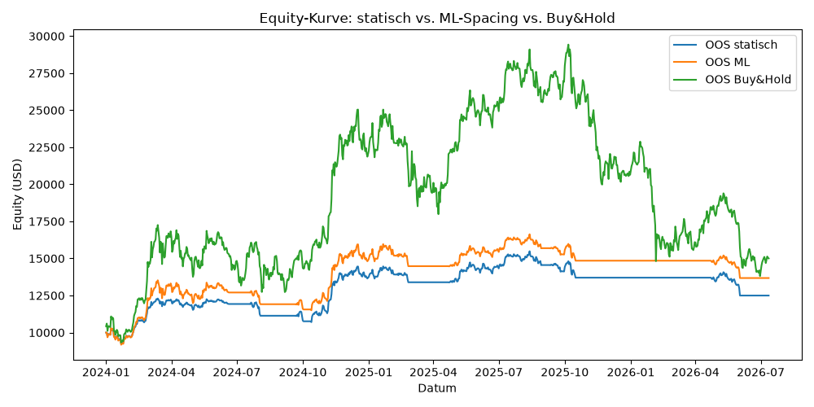

# BTC Grid Trading Bot

Automatisierter Bitcoin Grid-Trading-Bot mit **ML-optimiertem Grid-Spacing**
(Decision Tree Regressor), **120-Tage-SMA-Richtungsfilter** und **dynamischem
Stop-Loss**. Die Strategie kauft Dips und verkauft Rallyes innerhalb eines
Grids, fährt aber nur Long, wenn der SMA-Filter einen klaren Aufwärtstrend
bestätigt — sonst pausiert der Bot.

> Hinweis: Das ML-Modell ist ein **Decision Tree Regressor** (scikit-learn)
> mit Linear-Regression-Fallback — bewusst erklärbar und schnell trainierbar,
> keine GPU nötig.

## Setup

```bash
python -m venv .venv
source .venv/bin/activate
pip install -r requirements.txt
```

Jedes Modul ist eigenständig ausführbar (Selbsttest im `__main__`-Block), z.B.:

```bash
python config.py        # Sanity-Checks der Parameter
python data.py          # OHLCV-Daten laden
python sma_filter.py    # SMA + Entry/Exit/Stop testen
python ml_spacing.py    # Modell trainieren + Vorhersage
python backtest.py      # Vollständiger Backtest-Vergleich
```

## Module

| Modul | Beschreibung |
|---|---|
| `config.py` | Zentrale Konfiguration: alle Parameter, Grenzen und Gebühren an einem Ort. |
| `data.py` | Lädt BTC/USDT-Tagesdaten (UTC-Schluss) via ccxt, cacht sie lokal als CSV. |
| `sma_filter.py` | 120-Tage-SMA, Entry/Exit-Confirmation und dynamischer Stop-Loss (`SMA*0.99`). |
| `ml_spacing.py` | Feature-Berechnung, Training und Vorhersage des Grid-Spacings in % (`.pkl`). |
| `backtest.py` | Historische Simulation mit OHLC-Fill-Logik: statisch vs. ML vs. Buy&Hold. |

## Ergebnisse — Out-of-Sample (2022–2024)

Der entscheidende Vergleich auf ungesehenen Daten (Modell wurde nur auf
2017–2021 trainiert):

| Strategie | CAGR p.a. | Sharpe | Max-Drawdown |
|---|---|---|---|
| Statisch (0.5%) | 16,78 % | 0,89 | −23,18 % |
| **ML-Spacing** | **19,22 %** | **0,92** | **−22,55 %** |
| Buy & Hold | 26,40 % | 0,68 | −66,93 % |

**Kernaussage:** Buy & Hold erzielt zwar die höchste absolute Rendite, aber um
den Preis eines verheerenden Drawdowns von −67 %. Der Bot liefert den Großteil
der Rendite bei rund einem Drittel des Risikos. Das **ML-Spacing schlägt das
statische Spacing** risikoadjustiert (höherer Sharpe, geringerer Drawdown) bei
gleichzeitig deutlich weniger Trades und Gebühren.



## Disclaimer

Dieses Projekt dient ausschließlich Forschungs- und Ausbildungszwecken und ist
keine Anlageberatung. Handel mit Kryptowährungen ist hochriskant.
